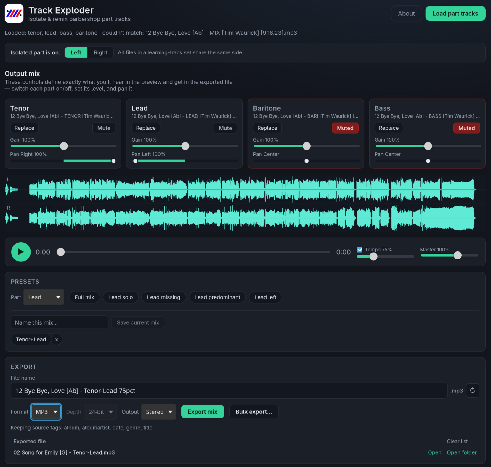

<p align="center"></p>

# Track Exploder

**Create customized barbershop learning tracks from part isolated tracks.**

Most barbershop learning tracks are provided as **"part-left" / "part-right"** files: one voice is hard-panned to a single stereo channel while the other three parts are summed on the opposite channel. Track Exploder loads the four files for a song (tenor, lead, baritone, bass), pulls out each isolated voice, and lets you build **any mix you want** — solo a part, drop your own part out to sing along, rebalance levels, re-pan, slow it down for practice **without changing the pitch**, and export.

<p align="center"></p>

## Features

- **Load the four part tracks** and auto-extract each voice.
- **Per-track channel selection** (left / right) in case the isolated part is panned the other way.
- **Mixer per part**: include/exclude, gain, pan, solo, mute.
- **Preview before export** with transport + waveform.
- **Tempo change without pitch change** (0.5×–1.5×) for slow practice — powered by [Signalsmith Stretch](https://signalsmith-audio.co.uk/code/stretch/) (MIT).
- **Save export presets** for quick re-use.
- **Export** to WAV / FLAC (MP3 optional; see licensing note below).
- **Keeps common tags** (album, title, date, genre, …) that all four source files share, writing them into FLAC and MP3 exports. Per-part tags like the voice name drop out automatically. (WAV tag chunks are not yet written.)
- **Bulk Export** to easily generate custom tracks

## Tech stack

| Layer | Choice |
| --- | --- |
| App shell | [Tauri v2](https://v2.tauri.app/) — one codebase for desktop **and** mobile |
| UI | Svelte 5 + TypeScript + Vite |
| Preview / mixing | Web Audio API |
| Time-stretch | Signalsmith Stretch (MIT) — WASM AudioWorklet |
| Decode / encode | Rust — [Symphonia](https://github.com/pdeljanov/Symphonia) (decode), `hound` / `flacenc` (encode) |

The Rust side is split into a pure-DSP crate (`crates/audio-core`) with no GUI dependencies (unit-testable in isolation) and a thin Tauri app crate (`src-tauri`).

## Known Issues

I've had some issues running the preview audio on bluetooth headphones. So try using the speakers or wired headphones for now until that can be sorted out.

## Installing

Prebuilt installers are attached to each [release](../../releases).

- **macOS / Windows** builds are unsigned, so you'll see a Gatekeeper / SmartScreen prompt. On macOS, right-click the app → **Open**; on Windows, **More info → Run anyway**.
- **Linux RPM** is GPG-signed. Import the signing key once (attached to the release as `track-exploder-signing-key.asc`), then install:

  ```bash
  sudo rpm --import track-exploder-signing-key.asc
  sudo zypper install ./Track.Exploder-*.rpm      # openSUSE
  # or verify explicitly:  rpm -K ./Track.Exploder-*.rpm
  ```

  Without importing the key you'll get a "package is not signed / signature verification failed" warning; you can still install with `sudo zypper install --allow-unsigned-rpm <file>`.

- **Linux on NVIDIA:** prefer the **RPM or `.deb`** over the AppImage. The AppImage bundles its own WebKitGTK/GL libraries, which can conflict with the NVIDIA driver and show a blank white window; the RPM/deb use your system WebKitGTK and work. The app disables WebKitGTK's DMABUF renderer on Linux automatically to avoid the related `EGL_BAD_ALLOC` crash — override with `WEBKIT_DISABLE_DMABUF_RENDERER=0` if you ever need to.

## Development

Prerequisites:

- **Node.js** ≥ 20 and npm
- **Rust** (stable) — install via <https://rustup.rs>
- **Tauri system dependencies** for your OS — see <https://v2.tauri.app/start/prerequisites/>.
  On Debian/Ubuntu: `libwebkit2gtk-4.1-dev build-essential libssl-dev libayatana-appindicator3-dev librsvg2-dev`.
  On openSUSE: `zypper install webkit2gtk3-devel libopenssl-devel gtk3-devel libappindicator3-devel librsvg-devel`.

```bash
npm install

# Run the desktop app in dev mode (hot reload):
npm run tauri dev

# Type-check the frontend:
npm run check

# Unit tests (frontend mix math):
npm test

# Unit tests (Rust DSP core — no webview deps needed):
cargo test -p audio-core

# Production build / installers:
npm run tauri build
```

## Licensing

Track Exploder is **MIT** licensed. The time-stretch library (Signalsmith Stretch) is also MIT.

MP3 export is an **optional** feature using the pure-Rust Shine encoder (LGPL); it is disabled by default to keep the core dependency graph permissive. WAV and FLAC export have no such restriction.

To enable MP3:

```bash
npm run tauri dev   -- --features mp3   # dev
npm run tauri build -- --features mp3   # release
cargo test -p audio-core --features mp3 # tests
```

MP3 uses the **pure-Rust** [Shine](https://github.com/wshon/shine-rs) encoder — no C toolchain, and it cross-compiles to any target (including Android). It's a fixed-point CBR encoder: great for practice tracks, a notch below LAME quality. Shine is **LGPL-2.0**, so it stays behind the optional `mp3` feature to keep the core dependency graph permissive; if you redistribute an MP3-enabled build, comply with the LGPL for that component. WAV and FLAC export have no such restriction.

**Do not** commit copyrighted learning tracks to this repository. The `samples/` directory is git-ignored for your local test audio.

## Contributing

See [CONTRIBUTING.md](CONTRIBUTING.md). By participating you agree to the [Code of Conduct](CODE_OF_CONDUCT.md).
