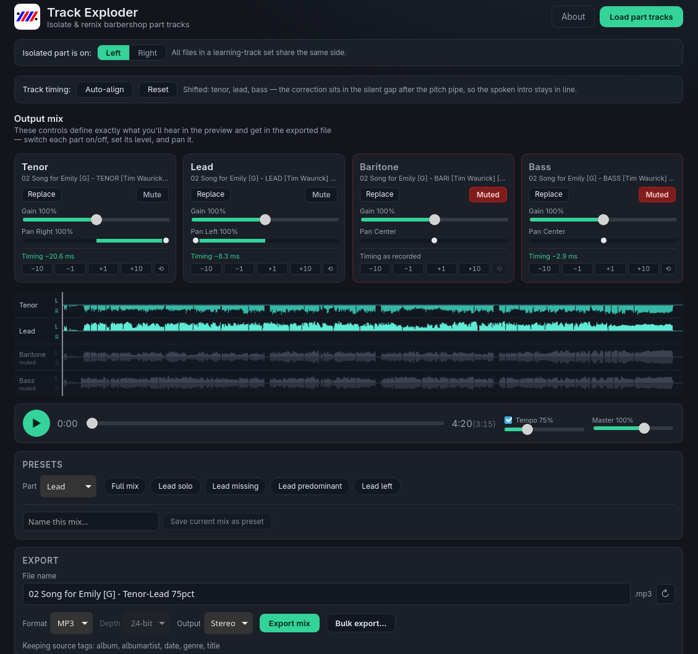

<p align="center"></p>

# Track Exploder

**Create customized barbershop learning tracks from part isolated tracks.**

Most barbershop learning tracks are provided as **"part-left" / "part-right"** files: one voice is hard-panned to a single stereo channel while the other three parts are summed on the opposite channel. Track Exploder loads the four files for a song (tenor, lead, baritone, bass), pulls out each isolated voice, and lets you build **any mix you want** — solo a part, drop your own part out to sing along, rebalance levels, re-pan, slow it down for practice **without changing the pitch**, and export.

<p align="center"></p>

## Features

- **Load the four part tracks** and auto-extract each voice.
- **Automatic track alignment** — publishers don't always paste the song in at the same spot in all four files, so parts can play tens (occasionally hundreds) of milliseconds apart. Track Exploder measures the set on load and lines it up, absorbing the correction in the silent gap after the pitch pipe so the spoken intro stays in sync. Every part strip shows its shift and can be nudged by hand.
- **Per-track channel selection** (left / right) in case the isolated part is panned the other way.
- **Mixer per part**: include/exclude, gain, pan, solo, mute.
- **Preview before export** with transport + waveform.
- **Tempo change without pitch change** (0.5×–1.5×) for slow practice — powered by [Signalsmith Stretch](https://signalsmith-audio.co.uk/code/stretch/) (MIT).
- **Save export presets** for quick re-use.
- **Export** to WAV / FLAC (MP3 optional; see licensing note below).
- **Keeps common tags** (album, title, date, genre, …) that all four source files share, writing them into FLAC and MP3 exports. Per-part tags like the voice name drop out automatically. (WAV tag chunks are not yet written.)
- **Bulk Export** to easily generate custom tracks

## Tech stack

| Layer | Choice |
| --- | --- |
| App shell | [Tauri v2](https://v2.tauri.app/) — one codebase for desktop **and** mobile |
| UI | Svelte 5 + TypeScript + Vite |
| Preview / mixing | Web Audio API |
| Time-stretch | Signalsmith Stretch (MIT) — WASM AudioWorklet |
| Decode / encode | Rust — [Symphonia](https://github.com/pdeljanov/Symphonia) (decode), `hound` / `flacenc` (encode) |

The Rust side is split into a pure-DSP crate (`crates/audio-core`) with no GUI dependencies (unit-testable in isolation) and a thin Tauri app crate (`src-tauri`).

## Known Issues

- I've had some issues running the preview audio on bluetooth headphones. So try using the speakers or wired headphones for now until that can be sorted out.
- Misaligned part files are detected and corrected automatically (and can be nudged per part), but a set whose offset *drifts* through the song can only be got close — the strip flags those with a ± figure.
- It does not do any processing to remove bleed if the predominant track is not panned with no bleed from the other parts (some tracks I have seen have a little bleedover)

## Future features

- more edge cases and UI interactions on top of the generated test tracks (see [Test audio](#test-audio))
- bleed reduction for sets where the isolated side isn't cleanly panned

To check a whole library for timing problems without opening the app:

```bash
cargo run --release -p audio-core --example check_alignment -- "/path/to/album folder"
```

## Installing

Prebuilt installers are attached to each [release](../../releases).

- **macOS / Windows** builds are unsigned, so you'll see a Gatekeeper / SmartScreen prompt. On macOS, right-click the app → **Open**; on Windows, **More info → Run anyway**.
- **Linux RPM** is GPG-signed. Import the signing key once (attached to the release as `track-exploder-signing-key.asc`), then install:

  ```bash
  sudo rpm --import track-exploder-signing-key.asc
  sudo zypper install ./Track.Exploder-*.rpm      # openSUSE
  # or verify explicitly:  rpm -K ./Track.Exploder-*.rpm
  ```

  Without importing the key you'll get a "package is not signed / signature verification failed" warning; you can still install with `sudo zypper install --allow-unsigned-rpm <file>`.

- **Linux:** the RPM and `.deb` use your system WebKitGTK and are the supported formats. (No AppImage — its bundled WebKitGTK/GL libraries white-screen on NVIDIA drivers.) The app disables WebKitGTK's DMABUF renderer on Linux automatically to avoid an `EGL_BAD_ALLOC` crash on some GPUs (notably NVIDIA); override with `WEBKIT_DISABLE_DMABUF_RENDERER=0` if you ever need to.

## Development

Prerequisites:

- **Node.js** ≥ 22 and npm
- **Rust** (stable) — install via <https://rustup.rs>
- **Tauri system dependencies** for your OS — see <https://v2.tauri.app/start/prerequisites/>.
  On Debian/Ubuntu: `libwebkit2gtk-4.1-dev build-essential libssl-dev libayatana-appindicator3-dev librsvg2-dev`.
  On openSUSE: `zypper install webkit2gtk3-devel libopenssl-devel gtk3-devel libappindicator3-devel librsvg-devel`.

```bash
npm install

# Run the desktop app in dev mode (hot reload):
npm run tauri dev

# Type-check the frontend:
npm run check

# Tests (frontend mix math, naming, and the generated audio fixtures):
npm test

# Tests (Rust DSP core — no webview deps needed):
cargo test -p audio-core

# Production build / installers:
npm run tauri build
```

### Test audio

Both suites run against a **generated learning-track set** rather than copyrighted
tracks. The song is a real barbershop arrangement in B♭ written to the style rules in
the Barbershop Harmony Society's [Music Educator
Guide](https://files.barbershop.org/PDFs/Education/Music-Educator-Guide-and-Songbook_v3.5.pdf):
barbershop sevenths resolving around the circle of fifths (`Bb → G7 → C7 → F7 → Bb`,
plus a tag onto a held post), justly tuned so the chords ring (4:5:6:7), melody in the
lead with the tenor above it, the guide's balance and voice ranges, swipes and a word
echo — and rests a quartet would actually sing: breaths, trio bars, and the harmony
sustaining under the melody's breath.

It is written to disk as real media (part-left and part-right WAVs, tagged FLACs,
optional MP3s, mono reference stems, and a deliberately **misaligned** copy shaped like
a publisher's — spoken title, pitch pipe, gap, song pasted in late) and put through the
whole pipeline: decode → extract the isolated voice → align → mix → time-stretch →
encode → read tags back. The tests also check the *music*: the voicing, the tuning, the
chord vocabulary and the balance.

`cargo test -p audio-core` and `npm test` generate it on demand; to refresh it or to
load it into the app by hand for UI testing:

```bash
cargo run -p audio-core --example generate_fixtures     # -> samples/fixtures/
```

The arrangement lives in `crates/audio-core/tests/support/score.rs`; see
[`samples/README.md`](samples/README.md) for the layout. (`npm test` shells out to
the generator, so without a Rust toolchain the fixture-backed frontend tests skip.)

## Licensing

Track Exploder is **MIT** licensed. The time-stretch library (Signalsmith Stretch) is also MIT.

MP3 export is an **optional** feature using the pure-Rust Shine encoder (LGPL); it is disabled by default to keep the core dependency graph permissive. WAV and FLAC export have no such restriction.

To enable MP3:

```bash
npm run tauri dev   -- --features mp3   # dev
npm run tauri build -- --features mp3   # release
cargo test -p audio-core --features mp3 # tests
```

MP3 uses the **pure-Rust** [Shine](https://github.com/wshon/shine-rs) encoder — no C toolchain, and it cross-compiles to any target (including Android). It's a fixed-point CBR encoder: great for practice tracks, a notch below LAME quality. Shine is **LGPL-2.0**, so it stays behind the optional `mp3` feature to keep the core dependency graph permissive; if you redistribute an MP3-enabled build, comply with the LGPL for that component. WAV and FLAC export have no such restriction.

**Do not** commit copyrighted learning tracks to this repository. The `samples/` directory is git-ignored for your local test audio.

## Contributing

See [CONTRIBUTING.md](CONTRIBUTING.md). By participating you agree to the [Code of Conduct](CODE_OF_CONDUCT.md).
